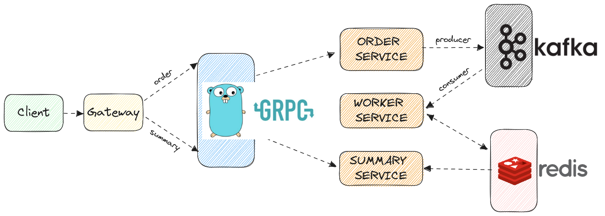

# Go OHLC ✨
## Architecture


## Technologies - Libraries
* [labstack/echo](https://go.dev/dl/) - as client gateway
* [grpc/grpc-go](https://github.com/grpc/grpc-go) - as protobuf transport layer
* [segmentio/kafka-go](https://github.com/segmentio/kafka-go) - as message broker, Kafka cluster with 3 node for scaling calculation
* [redis/go-redis](https://github.com/redis/go-redis/) - as data store
* [spf13/viper](https://github.com/spf13/viper) - as .env configuration
* [uber-go/zap](https://github.com/uber-go/zap) - as logger
* [go-playground/validator](https://github.com/go-playground/validator) - as struct validator
* [stretchr/testify](https://github.com/stretchr/testify) - as unit testing

## Setup Docker First
Run docker-compose.yaml
```
$ make docker-compose
```
After run this, don't forget to check all container are successfully started. Kafka GUI tools http://localhost:8080/

## How To Run This Project
1. Run Order Service
```
$ make run-order-service
```
2. Run Worker Service
```
$ make run-worker-service
```
3. Run Summary Service
```
$ make run-summary-service
```
4. Run Client
```
$ make run-client
```

## Endpoint 
### Order
To create order transaction
```http request
POST /order
```
```javascript
Example Request
{
    "stock_code" : "BBCA",
    "order_number" : "123",
    "type" : "E",
    "quantity": "200",
    "price" : "8100"
}
```
### Bulk Order
To create order transaction from .ndjson file
```http request
GET /bulk-order
```

### Summary
To get summary result
```http request
GET /summary/:stock-code
```